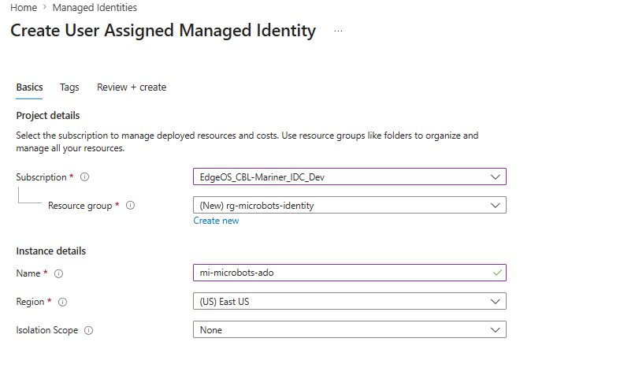
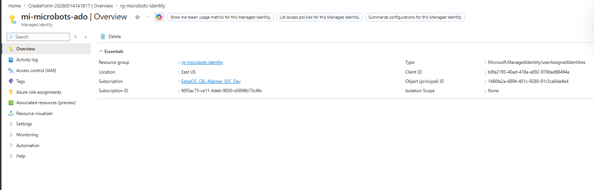
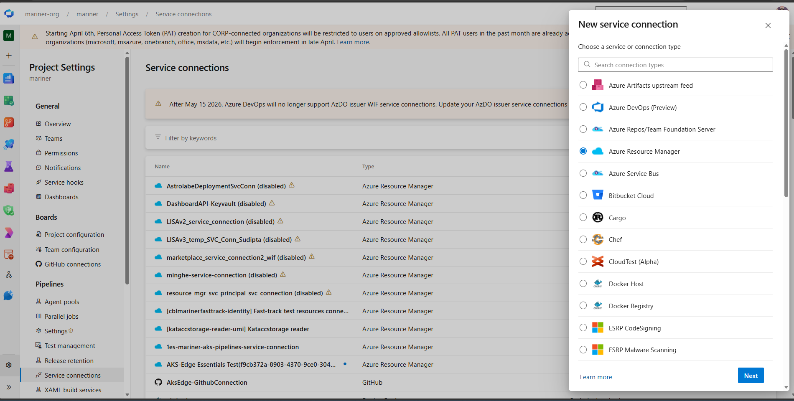
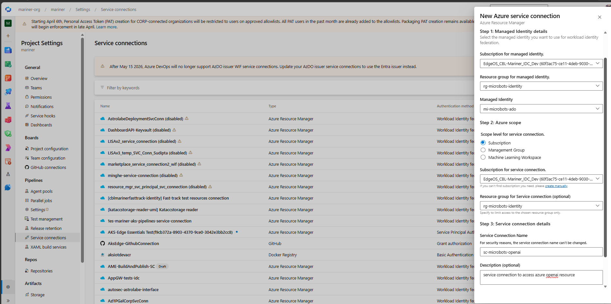

# Azure Managed Identity & Service Connection Setup

A complete, end-to-end walkthrough for setting up **Azure AD-based authentication** for Microbots running in **Azure Pipelines**. By the end of this guide, your pipeline will obtain Azure AD tokens automatically — no secrets, no API keys, no manual rotation.

> **Who is this for?** Anyone running **Microbots** in an Azure DevOps pipeline who wants to authenticate against Azure OpenAI using **workload identity federation** — the modern, secret-less way to do CI/CD auth on Azure. No API keys, no `.env` files, no rotation cron.

---

## What You'll Build

```
Azure Pipeline (running Microbots)
        │
        │ uses
        ▼
ADO Service Connection (Workload Identity Federation)
        │
        │ federated trust
        ▼
User-Assigned Managed Identity
        │
        │ RBAC role assignment
        ▼
Azure OpenAI
```

The pipeline never sees a secret. Azure DevOps exchanges its OIDC token for an Azure AD token tied to the managed identity, which has `Cognitive Services OpenAI User` on your Azure OpenAI resource — and Microbots picks that token up via `DefaultAzureCredential`.

---

## Part 1 — Create a User-Assigned Managed Identity

We use a **User-Assigned Managed Identity (UAMI)** (not system-assigned) because it can be federated with Azure DevOps and reused across multiple pipelines and resources.

### Option A — Azure Portal

1. In the Azure portal, search for **"Managed Identities"** and click **+ Create**. For the full reference, see the [official Azure portal walkthrough](https://learn.microsoft.com/en-us/entra/identity/managed-identities-azure-resources/manage-user-assigned-managed-identities-azure-portal).

2. Fill in the **Basics** tab:
    - **Subscription** — your subscription
    - **Resource group** — pick or create one (e.g. `rg-microbots-identity`)
    - **Region** — same region as your target resource is fine
    - **Name** — e.g. `mi-microbots-ado`

    

3. Click **Review + create**, then **Create**. After deployment, open the resource and copy three values from the **Overview** blade — you'll need them later:
    - **Client ID**
    - **Object (principal) ID**
    - **Subscription ID** and **Tenant ID**

    

### Option B — Azure CLI

The script below mirrors the steps in the [official Azure CLI walkthrough](https://learn.microsoft.com/en-us/entra/identity/managed-identities-azure-resources/manage-user-assigned-managed-identities-azure-cli).

```bash
# Variables
SUB_ID=$(az account show --query id -o tsv)
TENANT_ID=$(az account show --query tenantId -o tsv)
RG="rg-microbots-identity"
LOCATION="eastus"
MI_NAME="mi-microbots-ado"

# Create resource group (skip if it exists)
az group create -n "$RG" -l "$LOCATION"

# Create the user-assigned managed identity
az identity create -g "$RG" -n "$MI_NAME" -l "$LOCATION"

# Capture the IDs we'll need later
MI_CLIENT_ID=$(az identity show -g "$RG" -n "$MI_NAME" --query clientId -o tsv)
MI_PRINCIPAL_ID=$(az identity show -g "$RG" -n "$MI_NAME" --query principalId -o tsv)
MI_RESOURCE_ID=$(az identity show -g "$RG" -n "$MI_NAME" --query id -o tsv)

echo "Client ID:    $MI_CLIENT_ID"
echo "Principal ID: $MI_PRINCIPAL_ID"
echo "Resource ID:  $MI_RESOURCE_ID"
```

For PowerShell, ARM, Bicep, Terraform, or REST, refer to the [Microsoft Learn docs on managed identities](https://learn.microsoft.com/en-us/entra/identity/managed-identities-azure-resources/) — the rest of this guide is the same regardless of how the identity is created.

---

## Part 2 — Assign an RBAC Role to the Managed Identity

The managed identity needs permission on the **target resource**. For Microbots talking to Azure OpenAI, the least-privilege role is **`Cognitive Services OpenAI User`**.

> See [Understanding RBAC & Authentication](../blog/rbac-authentication.md) for the full breakdown of roles and trade-offs.

### Option A — Azure Portal

1. Open your **Azure OpenAI** (or target) resource → **Access control (IAM)** → **+ Add → Add role assignment**. For the full reference, see [Assign a managed identity access to a resource using the Azure portal](https://learn.microsoft.com/en-us/entra/identity/managed-identities-azure-resources/grant-managed-identity-resource-access-azure-portal).

2. On the **Role** tab, search for and select **Cognitive Services OpenAI User** → **Next**.

3. On **Members**, choose **Managed identity** → **+ Select members** → filter by **User-assigned managed identity**, pick `mi-microbots-ado`, then **Select** → **Next** → **Review + assign**.

4. Confirm the assignment appears under **Role assignments**.

### Option B — Azure CLI

```bash
# Target resource
AOAI_NAME="my-openai-resource"
AOAI_RG="rg-openai"

# Build & store the scope (resource ID) for reuse
AOAI_SCOPE=$(az cognitiveservices account show \
  -g "$AOAI_RG" -n "$AOAI_NAME" --query id -o tsv)

echo "Scope: $AOAI_SCOPE"

# Assign the role
az role assignment create \
  --assignee $MI_PRINCIPAL_ID \
  --role "Cognitive Services OpenAI User" \
  --scope $AOAI_SCOPE
```

> **Tip:** `$MI_PRINCIPAL_ID` is the managed identity's **Principal (Object) ID** captured in Part 1. `$AOAI_SCOPE` is the full ARM resource ID of your Azure OpenAI account — storing it once lets you reuse the same variable if your Microbots pipeline needs access to additional Azure OpenAI resources (see *Reusing This Setup for Other Microbots Pipelines* below).

---

## Part 3 — Create the Azure DevOps Service Connection

This is the bridge: an ADO **service connection** of type *Azure Resource Manager → Managed Identity → Workload identity federation* that points at the UAMI from Part 1.

1. In Azure DevOps: **Project Settings → Service connections → New service connection**. Select **Azure Resource Manager** → **Next**.

    

2. **Identity type:** select **`Managed identity`**. The form rearranges into the three steps shown below.

3. **Step 1 — Managed Identity details:** point ADO at the UAMI you created in Part 1.
    - **Subscription for managed identity** — the sub where the UAMI lives (`$SUB_ID`)
    - **Resource group for managed identity** — `rg-microbots-identity` (from Part 1)
    - **Managed Identity** — pick `mi-microbots-ado` from the dropdown

4. **Step 2 — Azure scope:** the scope the service connection grants pipelines access to (separate from where the MI lives).
    - **Scope level** — `Subscription`
    - **Subscription for service connection** — the subscription containing your **Azure OpenAI** resource
    - **Resource group for service connection** — pick the resource group containing your Azure OpenAI resource. The Portal nags you to set this for a reason: it limits what pipelines using this connection can touch.

5. **Step 3 — Service connection details:**
    - **Service connection name** — e.g. `sc-microbots-openai` *(can't be changed later)*
    - **Description** — optional
    - **Security** — leave *Grant access permission to all pipelines* **unchecked** (you'll authorize per-pipeline on first use)

    

6. Click **Save**. ADO creates the service connection **and** wires up the federated credential on your UAMI for you — no manual issuer/subject paste needed. The connection appears in the list, ready to use.

---

## Part 4 — Use the Service Connection in an Azure Pipeline

Add an `AzureCLI@2` (or `AzurePowerShell@5`) task that references the service connection. Inside the task, Azure DevOps automatically logs in as the managed identity — `az` commands and the **`AZURE_CLIENT_ID`**, **`AZURE_TENANT_ID`**, **`AZURE_SUBSCRIPTION_ID`**, **`idToken`** environment variables are available.

```yaml
# azure-pipelines.yml
trigger:
  - main

pool:
  vmImage: ubuntu-latest

variables:
  AZURE_SERVICE_CONNECTION: sc-microbots-openai
  AZURE_OPENAI_ENDPOINT: https://my-openai-resource.openai.azure.com
  AZURE_OPENAI_DEPLOYMENT_NAME: gpt-4o
  AZURE_OPENAI_API_VERSION: 2025-03-01-preview

steps:
  - checkout: self

  - task: UsePythonVersion@0
    inputs:
      versionSpec: '3.11'

  - script: |
      python -m pip install --upgrade pip
      pip install microbots
    displayName: Install Microbots

  - task: AzureCLI@2
    displayName: Run Microbots with federated identity
    inputs:
      azureSubscription: $(AZURE_SERVICE_CONNECTION)
      scriptType: bash
      scriptLocation: inlineScript
      addSpnToEnvironment: true   # exposes servicePrincipalId / tenantId / idToken
      inlineScript: |
        set -euo pipefail

        # Sanity check: confirm we're signed in as the managed identity
        az account show --query '{name:name, user:user.name}' -o table

        # Run your script — Microbots' DefaultAzureCredential picks up the
        # AzureCLI login automatically; no secrets needed.
        python scripts/run_bot.py
      workingDirectory: $(Build.SourcesDirectory)
```

A minimal `scripts/run_bot.py` to validate the end-to-end flow:

```python
from azure.identity import DefaultAzureCredential, get_bearer_token_provider
from microbots.MicroBot import MicroBot

token_provider = get_bearer_token_provider(
    DefaultAzureCredential(),
    "https://cognitiveservices.azure.com/.default",
)

bot = MicroBot(
    model="azure-openai/gpt-4o",
    folder_to_mount="/path/in/repo",
    token_provider=token_provider,
)
print(bot.run(task="Summarize README.md").response)
```

---

## Verifying the Whole Flow

Run the pipeline. In the **AzureCLI@2** task logs you should see:

- `az account show` reporting `user.name` matching your managed identity's **Client ID**
- No `Sharing access tokens with all installed extensions`-style warnings
- The Python step completing without `ClientAuthenticationError`

---

## Reusing This Setup for Other Microbots Pipelines

The same managed identity + service connection can authenticate **multiple Microbots pipelines** — different repos, different bots, different Azure OpenAI deployments. Just add another role assignment for each Azure OpenAI resource your bots need to reach:

```bash
# Second Azure OpenAI resource for another Microbots pipeline
AOAI_NAME_2="my-other-openai-resource"
AOAI_RG_2="rg-openai-team-b"

AOAI_SCOPE_2=$(az cognitiveservices account show \
  -g "$AOAI_RG_2" -n "$AOAI_NAME_2" --query id -o tsv)

az role assignment create \
  --assignee $MI_PRINCIPAL_ID \
  --role "Cognitive Services OpenAI User" \
  --scope $AOAI_SCOPE_2
```

One identity, one service connection, many Microbots pipelines.

---

## Next Steps

- **Conceptual background** → [Understanding RBAC & Authentication](../blog/rbac-authentication.md)
- **All authentication options** → [Authentication Setup](authentication.md)
- **Why secret-less matters** → [Microbots: Safety First Agentic Workflow](../blog/microbots-safety-first-ai-agent.md)
