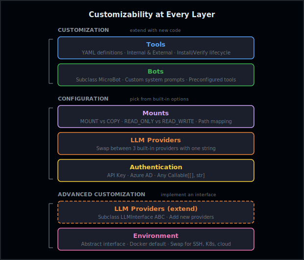
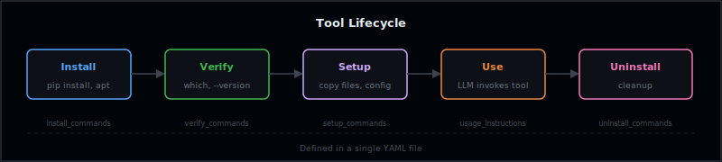
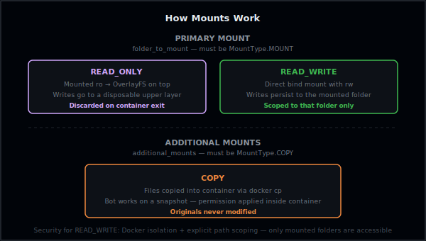
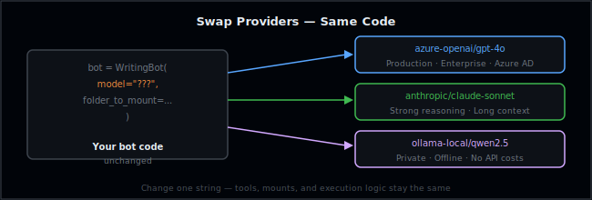
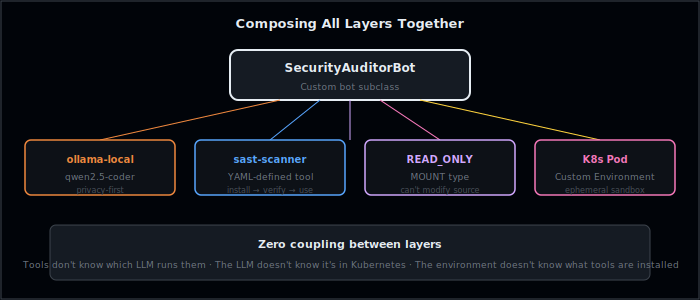

# Microbots: Customizability at Every Layer

**Published on:** May 14, 2026 | **Author:** Kavya Sree Kaitepalli

A user needed to extract text from scanned PDFs. We said: "Write 15 lines of YAML." No pull request. No release cycle. No code review. That's the kind of extensibility we built Microbots for.

> **Customization is a configuration choice — not a code-change project.**



---

## The Problem

Most agent frameworks bake everything in. Want a new tool? Edit the source. Want a different model? Rewrite the API call. Want to change how files are mounted? Good luck.

This leads to:

- **Forks that drift** — every team maintains their own version
- **Tight coupling** — changing the LLM breaks the tool system
- **Security risk** — no way to limit file access per bot

Microbots takes a different approach: **independent layers, each with a clean interface** — some you extend with new code (customization), others you tune with parameters (configuration).

---

# Customization

These layers let you extend Microbots by writing new code — without modifying the core.

## 1. Bring Your Own Tools

The most common customization: giving a bot new capabilities.

Instead of hardcoding tools into the base image, Microbots uses a **YAML-based tool definition system**. One file defines everything — what to install, how to verify it works, and how the LLM should use it.



### What a tool definition looks like

A tool YAML captures the full lifecycle in one file — install, verify, use, uninstall — plus a `usage_instructions_to_llm` field that gets injected into the system prompt so the LLM knows how to invoke it. Here's the shape:

```yaml
name: browser-use
tool_type: internal           # runs inside the Docker sandbox

install_commands:
  - pip install --no-input browser-use==0.5.4 playwright
  - playwright install chromium --with-deps --no-shell

usage_instructions_to_llm: |
  # The `browser` command is a CLI AI web browser.
  # Usage: browser "<query>"

uninstall_commands:
  - pip uninstall -y browser-use playwright
```

No Python code. No changes to MicroBot. Tools can be `internal` (runs inside the Docker sandbox) or `external` (runs on the host — useful for sub-agents or host-side logic).

> **Want to build one end-to-end?**
> Walk through [Custom Tool Integration: Tesseract OCR](../advanced/tools/tesseract_ocr_tool_use.md) — it builds a production-ready OCR tool from scratch and uses it to extract form fields from scanned documents.

---

## 2. Build Your Own Bot

Here's a secret: ReadingBot, WritingBot, BrowsingBot — they're all just **thin subclasses** of MicroBot. Each one sets a custom system prompt, preconfigures tools, and picks the right permission level. That's all.

You can do the same in ~10 lines:

```python
class SecurityAuditorBot(MicroBot):
    def __init__(self, model, folder_to_mount, **kwargs):
        sandbox = f"/{DOCKER_WORKING_DIR}/{Path(folder_to_mount).name}"
        super().__init__(
            model=model,
            folder_to_mount=Mount(folder_to_mount, sandbox, PermissionLabels.READ_ONLY),
            system_prompt="You are a security auditor. Find SQL injection, XSS, "
                          "hardcoded secrets, and insecure dependencies.",
            **kwargs,
        )
```

The base class handles the hard parts — the LLM loop, Docker lifecycle, command execution, response validation, and retries. You just define **what** the bot should do, not **how** it runs.

> **Every built-in bot follows this exact pattern.**
> Check the source: [ReadingBot](https://github.com/microsoft/microbots/blob/main/src/microbots/bot/ReadingBot.py), [WritingBot](https://github.com/microsoft/microbots/blob/main/src/microbots/bot/WritingBot.py), [LogAnalysisBot](https://github.com/microsoft/microbots/blob/main/src/microbots/bot/LogAnalysisBot.py).

---

# Configuration

These layers don't require new code — you pick from built-in options to shape how your bot runs.

## 3. Scope File Access with Mounts



Mounts control what the bot can see and how its changes are handled. The primary mount (`folder_to_mount`) must be `MountType.MOUNT` — `READ_ONLY` gets an **OverlayFS** so writes stay in a disposable layer and are discarded when the container exits, while `READ_WRITE` is a direct bind mount so the bot's writes are **persisted to the mounted folder** (and only that folder). Additional mounts must be `MountType.COPY` — files are copied into the container via `docker cp`, so the original files are never modified.

For `READ_WRITE`, security comes from **scoping**: you only mount the specific folder the bot needs, and Docker isolation prevents access to anything outside that folder.

```python
from microbots.extras.mount import Mount, MountType
from microbots.constants import PermissionLabels

code_mount = Mount(
    host_path="/home/user/project/src",
    sandbox_path="/workdir/src",
    permission=PermissionLabels.READ_WRITE,
    mount_type=MountType.MOUNT,       
)

docs_mount = Mount(
    host_path="/home/user/project/docs",
    sandbox_path="/workdir/docs",
    permission=PermissionLabels.READ_ONLY,
    mount_type=MountType.COPY,          # copied in — originals untouched
)

bot = MicroBot(model="azure-openai/gpt-4o", folder_to_mount=code_mount)
response = bot.run(task="Fix the bug in auth.py", additional_mounts=[docs_mount])
```

## 4. Switch LLM Providers



Switch between the three built-in providers by changing one string — everything else stays the same:

```python
bot = WritingBot(model="azure-openai/gpt-4o", folder_to_mount="/project")
bot = WritingBot(model="anthropic/claude-sonnet-4-20250514", folder_to_mount="/project")
bot = WritingBot(model="ollama-local/qwen2.5-coder", folder_to_mount="/project")
```

Need a provider that doesn't exist yet? See [Advanced Customization](#6-add-a-new-llm-provider) below.

## 5. Plug In Your Own Auth

Authentication is a callable — any `Callable[[], str]` works:

```python
# Azure AD (built-in)
from azure.identity import DefaultAzureCredential, get_bearer_token_provider

credential = DefaultAzureCredential()
token_provider = get_bearer_token_provider(credential, "https://cognitiveservices.azure.com/.default")

bot = WritingBot(model="azure-openai/gpt-4o", folder_to_mount="/project", token_provider=token_provider)
```

```python
# Or anything custom
def my_auth() -> str:
    return fetch_token_from_vault("my-secret")

bot = WritingBot(model="azure-openai/gpt-4o", folder_to_mount="/project", token_provider=my_auth)
```

For more on why Microbots supports both API keys and Azure AD, see [Understanding RBAC & Authentication](rbac-authentication.md).

---

# Advanced Customization

These layers let you replace core infrastructure by implementing an interface. The difference from Configuration: **configuration picks from what's already there; advanced customization adds what isn't.**

## 6. Add a New LLM Provider

Swapping between the three built-in providers is [configuration](#4-switch-llm-providers). But the LLM layer is also an abstract interface — `LLMInterface(ABC)` with `ask()` and `clear_history()`. To add a provider that doesn't exist yet, subclass it:

```python
from microbots.llm.llm import LLMInterface, LLMAskResponse

class MyCustomLLM(LLMInterface):
    def ask(self, message: str) -> LLMAskResponse:
        # call your model here
        ...

    def clear_history(self) -> bool:
        self.messages = []
        return True
```

## 7. Swap the Execution Environment

Microbots runs commands in Docker by default, but the execution environment is an **abstract interface**:

```python
class Environment(ABC):
    def start(self): ...
    def stop(self): ...
    def execute(self, command: str, timeout: int = 300) -> CmdReturn: ...
```

Implement this interface and pass it as `environment=` to any bot. You could build:

- **SSH remote execution** — run on a remote server
- **Kubernetes pods** — ephemeral sandboxes per bot run
- **Local process** — skip Docker for trusted environments
- **Cloud sandboxes** — Azure Container Instances, AWS Fargate

The rest of Microbots doesn't notice the difference.

---

## How the Layers Compose

The power is in **composition**. Each layer is independent, so you can mix and match:



```python
sast_tool = parse_tool_definition("sast-scanner.yaml")
k8s_env = KubernetesEnvironment(namespace="bots")

bot = SecurityAuditorBot(
    model="ollama-local/qwen2.5-coder",   # private LLM
    folder_to_mount="/path/to/code",       # read-only mount
    additional_tools=[sast_tool],           # custom tool
    environment=k8s_env,                    # K8s instead of Docker
)
```

No layer knows about the others. Tools don't care which LLM runs them. The LLM doesn't care whether it's in Docker or Kubernetes. The environment doesn't care what tools are installed.

---

## What This Means for You

**Customization** (write new code):

| If you want to... | What to do |
|-------------------|------------|
| Add a new capability to a bot | **Tools** — write a YAML definition |
| Change bot behavior or personality | **Bot** — subclass with a custom system prompt |

**Configuration** (pick from built-in options):

| If you want to... | What to do |
|-------------------|------------|
| Control what files the bot touches | **Mounts** — set permissions and mount types |
| Switch to a different built-in model | **LLM Provider** — change one string |
| Use your own auth system | **Auth** — pass a `Callable[[], str]` |

**Advanced Customization** (implement an interface):

| If you want to... | What to do |
|-------------------|------------|
| Add an entirely new LLM provider | **LLM Provider** — subclass `LLMInterface` |
| Run somewhere other than Docker | **Environment** — implement the ABC |

Each layer has a simple interface, sensible defaults, and zero coupling to the others. Customize one without touching the rest.

---

**Every layer is a 15-line decision, not a 1,500-line fork.**
