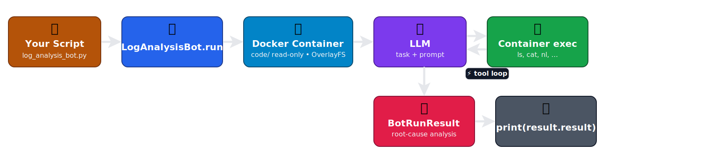

# Microbots Execution Flow

You built a complete Microbots project — a sample C application with a deliberate error and a `LogAnalysisBot` run that produced a root-cause analysis without ever modifying your host filesystem.

## What Just Happened

`python3 log_analysis_bot.py` triggered the framework to:

1. **Create a Docker container** with `code/` mounted read-only via OverlayFS.
2. **Send the task** to the LLM with a `LogAnalysisBot` system prompt.
3. **Execute shell commands** inside the container (`ls`, `cat`, `nl`, …) as directed by the LLM.
4. **Return a [`BotRunResult`](../api-reference/microbots/MicroBot.md#microbots.MicroBot.BotRunResult)** containing the root-cause analysis.

The following diagram shows the end-to-end flow:

{ loading=lazy }

The host filesystem was never writable from the bot.

## Next Step

Pick whichever fits your goal:

- **Debug a Microbots run** — Continue to [Configure Logging in Microbots](microbots-logging.md) to turn on Python logging for Microbots and learn how to read those logs.
- **Try a different bot** — Browse the [Available Bots](#available-bots) below and jump into the one that fits your use case.

## Available Bots

| Bot                                                                  | Permission | Description                                            |
| -------------------------------------------------------------------- | ---------- | ------------------------------------------------------ |
| [`ReadingBot`](../api-reference/microbots/bot/ReadingBot.md)         | Read-only  | Reads files and extracts information.                  |
| [`WritingBot`](../api-reference/microbots/bot/WritingBot.md)         | Read-write | Reads and writes files to fix issues or generate code. |
| [`BrowsingBot`](../api-reference/microbots/bot/BrowsingBot.md)       | —          | Browses the web to gather information.                 |
| [`LogAnalysisBot`](../api-reference/microbots/bot/LogAnalysisBot.md) | Read-only  | Analyzes logs for root-cause debugging.                |
| [`AgentBoss`](../api-reference/microbots/bot/AgentBoss.md)           | —          | Orchestrates multiple bots for complex tasks.          |

