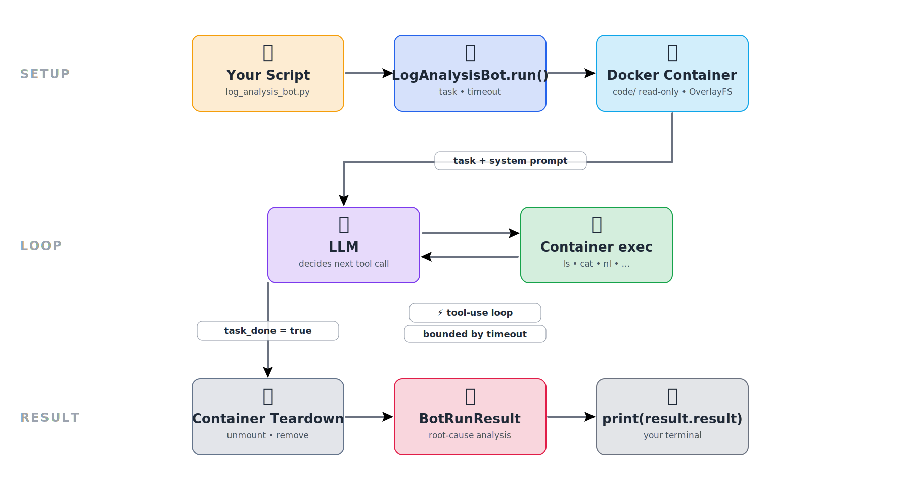
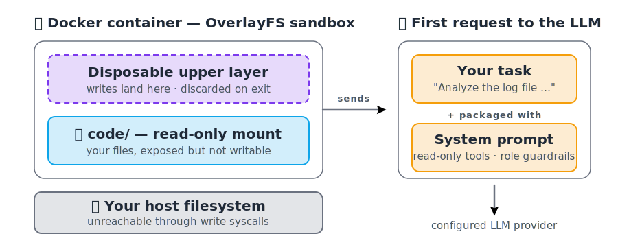
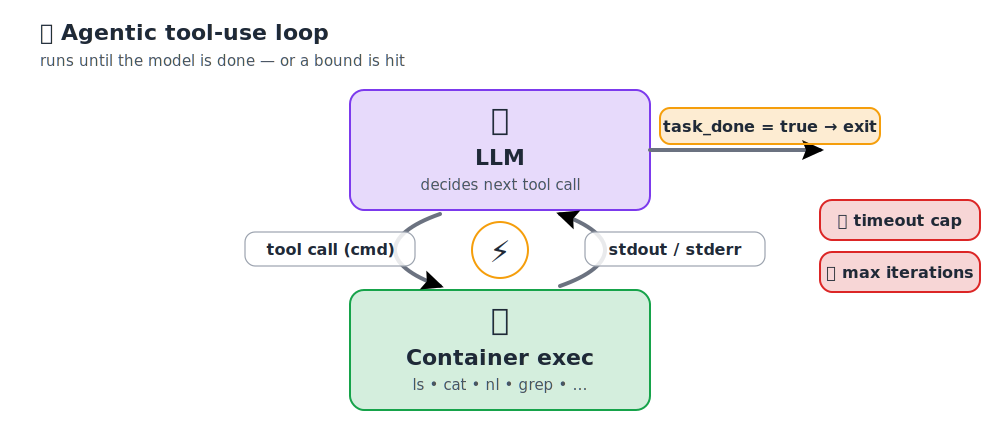
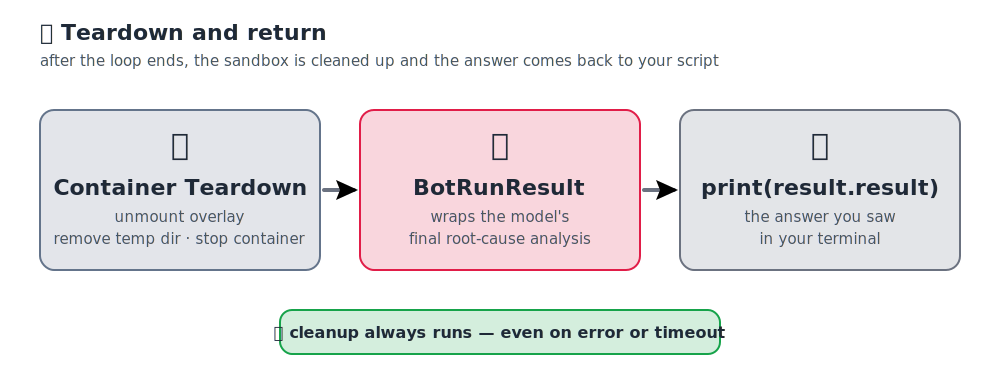

# Microbots Execution Flow

You ran your first Microbots example — a `LogAnalysisBot` against a sample C application with a deliberate error — and got a root-cause analysis without ever modifying your host filesystem.

## What Just Happened

When you ran `python3 log_analysis_bot.py`, Microbots quietly orchestrated a sandboxed agentic loop on your behalf. The diagram below shows the full end-to-end flow, organized into three phases that the rest of this page walks through:

{ loading=lazy }

- **SETUP** *(top row)* — your script calls `LogAnalysisBot.run()`, which provisions a Docker container with your `code/` directory mounted read-only via OverlayFS, and sends your task plus a system prompt down to the LLM.
- **LOOP** *(middle row)* — the LLM and `Container exec` exchange messages back and forth: each turn the LLM picks a shell command, the container runs it, and the output is fed back. The loop exits when the model signals `task_done = true`, and is bounded by your timeout.
- **RESULT** *(bottom row)* — the container is torn down (overlay unmounted, working directory removed), the model's analysis is wrapped in a `BotRunResult`, and `print(result.result)` produces the output you saw in your terminal.

Each phase is explained in detail below, with a focused diagram for the parts that need one.

### SETUP — preparing the sandbox

{ loading=lazy }

The diagram has two halves. The **left half** shows how your code is sandboxed; the **right half** shows what gets sent to the LLM on the very first turn.

**Left — the OverlayFS sandbox (inside a fresh Docker container):**

- **Disposable upper layer** *(dashed box on top)* — any writes the bot attempts land here and are thrown away when the container exits.
- **`code/` — read-only mount** *(solid box below)* — your project files are visible to the bot but cannot be modified.
- **Your host filesystem** *(slate panel at the bottom)* — sits outside the container and is unreachable through write syscalls.

**Right — the first request to the LLM:**

- **Your task** *(top box)* — the natural-language instruction you passed to `.run(...)`.
- **System prompt** *(bottom box)* — the `LogAnalysisBot` role definition that only exposes read-only tools and enforces guardrails.
- Both are **packaged together** and sent to your **configured LLM provider** as the very first message.

### LOOP — the agentic tool-use cycle

{ loading=lazy }

The diagram shows two boxes connected by a tight cycle, plus two side conditions that govern when the cycle stops.

- **LLM** *(top box)* — on every turn it returns a structured **tool call** (the down-arrow labeled `tool call (cmd)`): a small shell command such as `ls /var/log`, `cat /var/log/build.log`, or `nl -ba build.log`.
- **Container exec** *(bottom box)* — executes the command inside the sandbox and sends the **stdout / stderr** back to the model (the up-arrow). The ⚡ badge in the middle marks this `LLM ⇄ Container exec` cycle, which repeats over several iterations until the model has enough evidence.
- **Exit condition** *(yellow badge on the right)* — when the model says `task_done = true`, the loop stops.
- **Safety limits** *(red badges on the right)* — the loop also stops if it hits your **timeout** or the **max number of tries**, so the bot can't keep running forever.

### RESULT — teardown and return

{ loading=lazy }

The diagram shows three steps from left to right, plus one safety guarantee at the bottom.

- **Container Teardown** *(left box)* — once the loop ends, Microbots **unmounts the OverlayFS overlay**, **removes the temporary working directory**, and **stops the container**.
- **BotRunResult** *(middle box)* — the model's final root-cause analysis is wrapped in a [`BotRunResult`](../api-reference/microbots/MicroBot.md#microbots.MicroBot.BotRunResult) object and handed back to your Python code.
- **`print(result.result)`** *(right box)* — `result.result` holds the analysis text, which is what you saw printed in your terminal.
- **Cleanup always runs** *(green badge at the bottom)* — teardown happens whether the run succeeded, errored out, or hit the timeout, so the container and overlay never leak.

### Why this matters

Every run follows this same three-phase flow: a sandboxed container, a read-controlled tool-use loop, and a guaranteed teardown. The goal is simple — your code and your machine stay safe, no matter what the model decides to do.

!!! tip "Read more: Safety-first AI agents"
    For a deeper look at how Microbots keeps your machine safe, see the blog post **[Microbots: a safety-first AI agent](../blog/microbots-safety-first-ai-agent.md)**.

## Next Step

Pick whichever fits your goal:

- **Debug a Microbots run** — Continue to [Configure Logging in Microbots](microbots-logging.md) to turn on Python logging for Microbots and learn how to read those logs.
- **Try a different bot** — Browse the [Available Bots](#available-bots) below and jump into the one that fits your use case.

## Available Bots

Similar to `LogAnalysisBot`, you can explore other pre-built bots that ship with Microbots. The table below lists them along with their special capabilities.

| Bot                                                                  | Permission | Description                                            |
| -------------------------------------------------------------------- | ---------- | ------------------------------------------------------ |
| [`ReadingBot`](../api-reference/microbots/bot/ReadingBot.md)         | Read-only  | Reads files and extracts information.                  |
| [`WritingBot`](../api-reference/microbots/bot/WritingBot.md)         | Read-write | Reads and writes files to fix issues or generate code. |
| [`BrowsingBot`](../api-reference/microbots/bot/BrowsingBot.md)       | —          | Browses the web to gather information.                 |
| [`LogAnalysisBot`](../api-reference/microbots/bot/LogAnalysisBot.md) | Read-only  | Analyzes logs for root-cause debugging.                |
| [`AgentBoss`](../api-reference/microbots/bot/AgentBoss.md)           | —          | Orchestrates multiple bots for complex tasks.          |

Try them on different use cases — and feel free to open a [GitHub issue](https://github.com/microsoft/microbots/issues) if you run into any problems while building your agent. We're happy to help.

