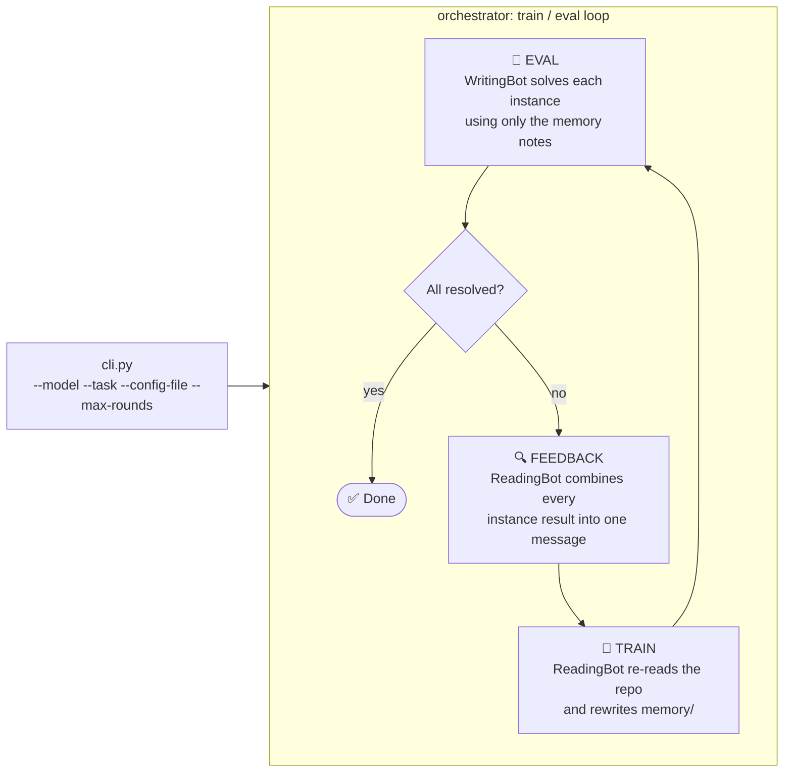
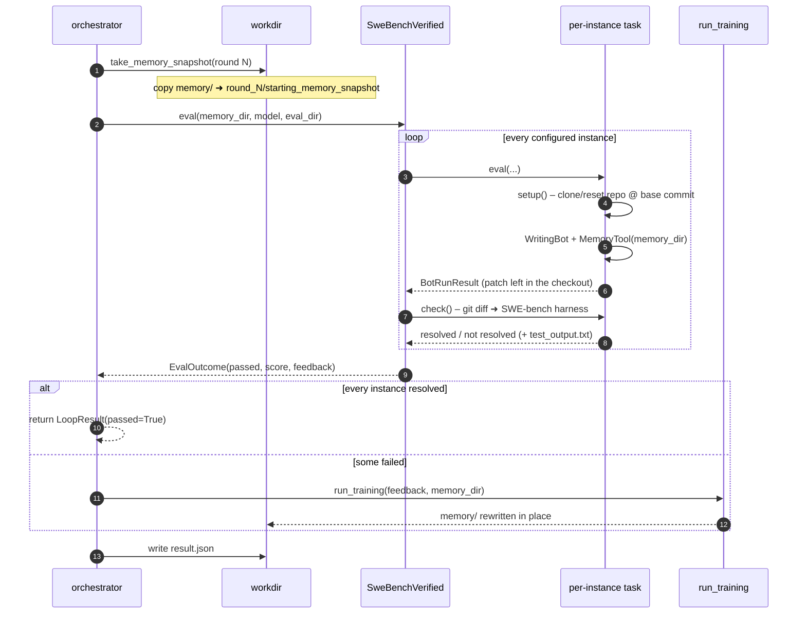
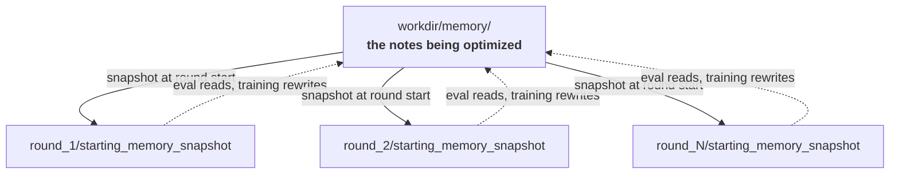

# auto_memory — Architecture

An agent that **learns a repository into memory notes**, then **proves those notes work** by
solving real SWE-bench issues with them. If it fails, it learns from the failure and retries.

> Train → Eval → Feedback → Train → … until every instance passes (or rounds run out).

---

## 1. The Big Picture



**Key idea:** the eval agent gets *no* hints beyond the memory notes.
A failing eval is therefore direct evidence the notes are wrong or incomplete.

---

## 2. The Cast

| File | Role | One-liner |
|---|---|---|
| `cli.py` | Entry point | Resolves the workdir + config, builds the task, calls the orchestrator |
| `orchestrator.py` | Conductor | Clones the training repo, owns the round loop, wires eval ↔ training |
| `evalTask.py` | Contract | `EvalTask`: `parse_config`, `repo_url`, `eval` → `EvalOutcome` |
| `task_registry.py` | Plugin table | `@register_task("name")` + auto-import of everything in `eval/` |
| `eval/swebenchverified.py` | The task | A **set** of SWE-bench-Verified instances, graded by the official harness |
| `training/runner.py` | Trainer | One `ReadingBot` pass with a `MemoryTool` |
| `training/training_instructions.md` | Trainer's brief | "Learn the repo, write notes, never edit code" |
| `workdir.py` | Filing clerk | Every path under `workdir/` lives here — nothing is hard-coded elsewhere |

---

## 3. One Round, Step by Step



`score` is the **fraction of instances resolved**; `passed` is true only when it reaches `1.0`.
An eval that raises is caught, recorded as `score = -1`, and the loop moves on — one bad
round never discards the rounds before it.

---

## 4. Memory Lifecycle

Memory is a **directory of markdown notes** with a single home. It is mutated in place;
each round snapshots its starting state so nothing is lost.



Rules that matter:

- **One live copy.** Both the eval agent and the training agent point at `workdir/memory`.
- **Snapshots are read-only history.** `round_N/starting_memory_snapshot` is what round N began with,
  so you can diff what a round actually learned.
- **Re-running archives, it doesn't append.** `require_workdir` moves the old workdir to
  `workdir_backup_<timestamp>` and carries `task_config.yaml`, `memory/` and `repo/` forward,
  so a new run resumes from prior knowledge with clean round output.

---

## 5. Workdir Layout

```text
workdir/
├── task_config.yaml       # instance_id_list: [...]  or  repo: django/django
├── repo/                  # training checkout, reused across rounds
├── memory/                # the notes being optimized  ← the thing under test
└── rounds/round_N/
    ├── starting_memory_snapshot/   # memory/ as it looked when the round began
    ├── logs/                       # training logs
    └── eval/                       # owned entirely by the eval task, fresh per round
        ├── eval_repo/<instance_id>/   # one checkout per instance, reset if re-run
        ├── logs/<instance_id>_log.txt
        └── result.json
```

Two checkouts on purpose: each instance gets its own subdirectory under `eval_repo/`, which is
reset (`git reset --hard` + `git clean -fd`) only if that instance is evaluated again within the
same round; it is never a single shared checkout that could clobber the training checkout in
`repo/`.

---

## 6. Running It

```bash
# task_config.yaml selects the eval set, by ID list...
#   instance_id_list:
#     - django__django-11099
# ...or by repo:
#   repo: django/django

python -m microbots.auto_memory.cli \
    --model azure-openai/gpt-5.5 \
    --task swebenchverified \
    --workdir ./workdir \
    --max-rounds 5
```

All instances in one config must belong to the **same repo** — that repo is what the training
agent learns, and `SweBenchVerified.repo_url()` derives it from the dataset.

---

## 7. Adding a New Eval Task

Drop a module in `eval/`. `discover_tasks()` imports everything in that package, so the
`@register_task` decorator fires and the name appears in `--task`. No central factory to edit.

```python
@register_task("mytask")
class MyTask(EvalTask):
    def parse_config(self, config_file: Path) -> None:
        ...   # load your settings; set self._repo_url or override repo_url()

    def eval(self, memory_dir: str, model: str, eval_dir: str, training_repo_dir: str) -> EvalOutcome:
        ...   # run every unit of work, return one combined outcome
```

Required: `eval`. `parse_config` and `repo_url` have working defaults driven by the config
file's `repo` key. The base `__init__` calls `parse_config` for you — so if you override
`__init__`, initialize your own state *before* calling it.

---

## 8. Failure Handling at a Glance

| Where it breaks | What happens |
|---|---|
| Agent run raises | Caught per instance; logged; that instance counts as failed |
| Harness never writes `test_output.txt` | `error` falls back to the harness's console output |
| Feedback bot unavailable | Falls back to the raw concatenated per-instance results |
| `task.eval` raises | Logged; recorded as `score = -1`; loop continues to the next round |
| Training raises | Logged; loop continues to the next round without retraining |
| `max_rounds` exhausted | `LoopResult(passed=False)` with every round's outcome |

Whatever happens, the round's `result.json` is still written.
